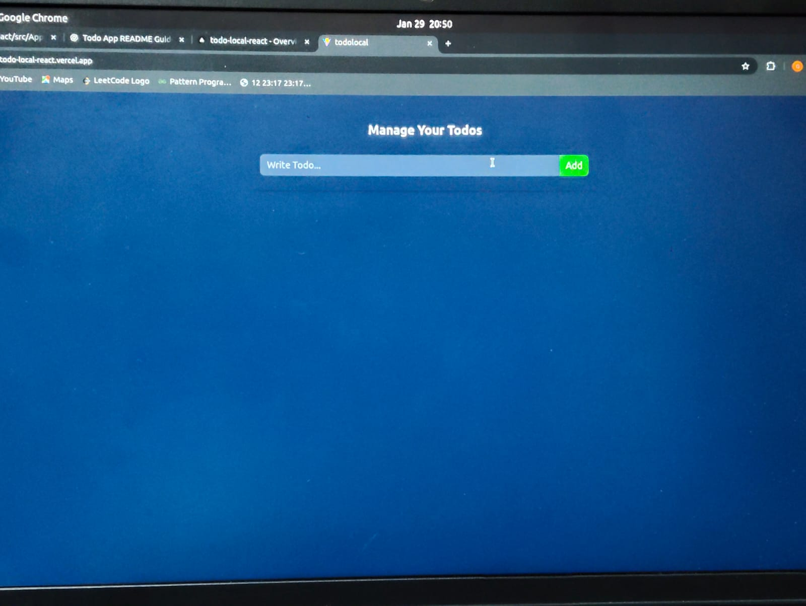

# 📝 Todo App with Local Storage

A simple and clean **Todo Application** built using **React**, **Vite**, and **Tailwind CSS**. This app allows users to add, update, delete, and mark todos as complete, with data persisted using **Local Storage** so your todos remain saved even after refreshing the page.

---

## 🚀 Live Demo

👉 [Click here to use the app](https://todo-local-react.vercel.app/)
---

## 🧰 Features

* ➕ Add new todos
* ✏️ Edit existing todos
* ❌ Delete todos
* ✅ Mark todos as completed / uncompleted
* 💾 Persistent storage using **localStorage**
* 🎨 Responsive & minimal UI with Tailwind CSS
* ⚡ Fast performance with Vite

---

## 🛠 Tech Stack

* **React** (useState, useEffect, Context API)
* **Vite**
* **Tailwind CSS**
* **JavaScript**
* **Local Storage**

---

## 🧠 Core Concepts Used

* **React Hooks**: `useState`, `useEffect`
* **Context API** for global state management
* **Local Storage** for data persistence
* **Component-based architecture**

---

## 📁 Project Structure

```
src/
│── components/
│   ├── TodoForm.jsx
│   └── TodoItem.jsx
│
│── contexts/
│   └── TodoContext.js
│
│── App.jsx
│── main.jsx
│── index.css
```

---

## 📸 Screenshots



---

## 📦 Installation

### 1. Clone the repository

```bash
git clone https://github.com/Gitanjali23/todoLocal-react
cd Todolocal
```

### 2. Install dependencies

```bash
npm install
```

### 3. Start the development server

```bash
npm run dev
```

---

## 💾 How Local Storage Works

* On initial load, todos are fetched from `localStorage`
* Every change in todos updates `localStorage`

```js
useEffect(() => {
  const todos = JSON.parse(localStorage.getItem("todos"))
  if (todos && todos.length > 0) {
    setTodos(todos)
  }
}, [])

useEffect(() => {
  localStorage.setItem("todos", JSON.stringify(todos))
}, [todos])
```

---

## 🌐 Deployment

This project can be easily deployed on **Vercel**.

Steps:

1. Push your project to GitHub
2. Connect your GitHub repository to Vercel
3. Deploy (auto-deploys on every push to `main` branch)

---

## 👤 Author

Made with 💙 by **Gitanjali Jaiswal**

 [GitHub] : (https://github.com/Gitanjali23)

---

✨ *Feel free to fork this repo and enhance it with filters, due dates, or drag-and-drop!*
